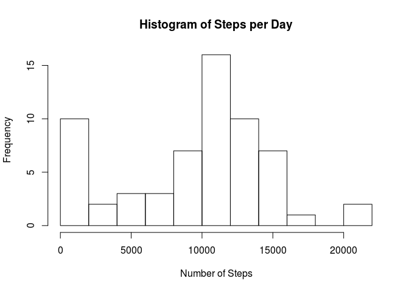
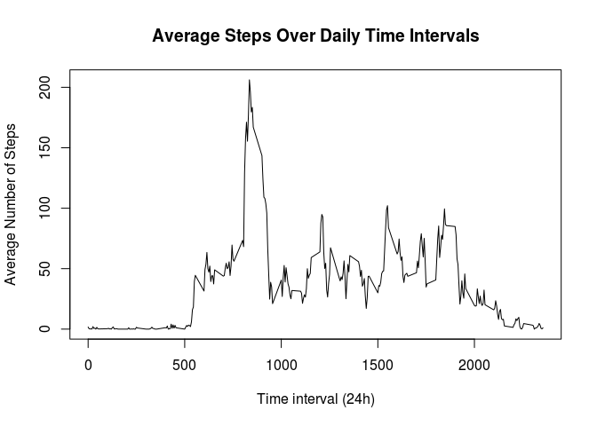
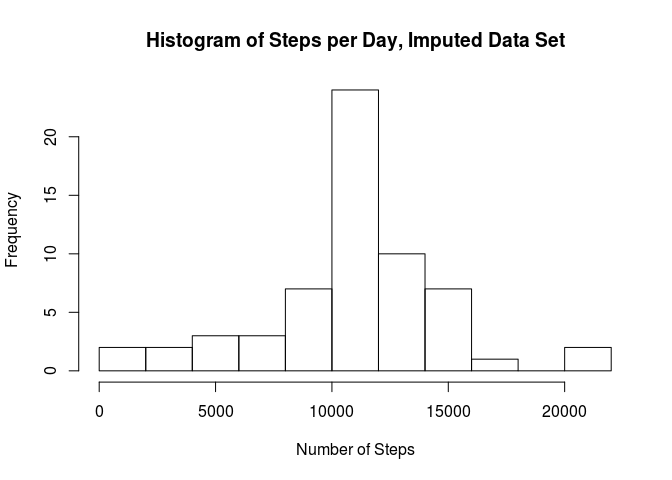
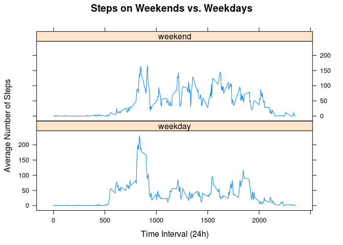

Assuming this notebook is in the same directory as the csv file, this will import the data into a data frame.


```r
active <- read.csv("activity.csv")
```
  
## Mean Steps per Day
Create a sum using `tapply`. Setting `na.rm` to `TRUE` will turn all `NA` values to zero, effectively. We can the create a histogram and generate summary statistics.


```r
dailySteps <- tapply(active$steps,active$date,sum,na.rm=TRUE)
dailyMean <- mean(dailySteps)
dailyMedian <- median(dailySteps)
```


We see that, in units of steps:  
- Mean:   9354.2295082  
- Median: 10395  


```r
hist(dailySteps, 
     breaks = 8,
     main="Histogram of Steps per Day",
     xlab="Number of Steps",
     ylab="Frequency")
```

<!-- -->

  
## Daily Activity Pattern
To find the average number of steps by interval, we can use the `aggregate` function. Here we average the number of steps aggregated by the interval value. From this we can efficiently make a plot.


```r
int_steps <- aggregate(active$steps,list(active$interval),mean,na.rm=TRUE)
names(int_steps) <- c("Interval","Avg_Steps")
plot(int_steps$Interval,int_steps$Avg_Steps,
     type = "l",
     main = "Average Steps Over Daily Time Intervals",
     xlab = "Time interval (24h)",
     ylab = "Average Number of Steps"
     )
```

<!-- -->

It is then straightforward to find which time interval had the largest average number of steps. 


```r
max_int <- int_steps$Interval[which.max(int_steps$Avg_Steps)]
```

And we see that at the value is 0835h in military time.    

- Maximum average steps occurs at 835  
  
  
## Data Imputation


```r
num_na <- sum(is.na(active$steps))
```

- There are 2304 `NA` values in the steps data

To correct for this, we use the daily average found for that time interval in the last section. 


```r
imputed <- is.na(active$steps) * int_steps$Avg_Steps
imputed_frame <- active
imputed_frame$steps[is.na(imputed_frame$steps)] <- 0
imputed_frame$steps <- imputed_frame$steps + imputed
```

We can then perform the analysis from our first section on this imputed data set.


```r
imputedSteps <- tapply(imputed_frame$steps,imputed_frame$date,sum,na.rm=TRUE)
imputedMean <- mean(imputedSteps)
imputedMedian <- median(imputedSteps)

hist(imputedSteps,
     breaks = 8,
     main="Histogram of Steps per Day, Imputed Data Set",
     xlab="Number of Steps",
     ylab="Frequency")
```

<!-- -->

Using this technique:  
- mean:   10766.1886792  
- median: 10766.1886792

From the histogram and these values, the data imputation removed a lot of effective zero values, increasing the mean and the median. Additionally, the convergence of the mean and median as well as the subjective shape of the graph indicate that data imputation in this manner normalized our data with respect to total number of steps per day.


## Weekend vs. Weekdays

Here we use the imputed data to compare behavior on weekdays and weekends. First step is to add a column to our imputed data frame indicating a factor variable. The `lubridate` library facilitates days as numbers which makes this slightly easier.


```r
suppressMessages(library(lubridate))
weekend <- factor(wday(ymd(imputed_frame$date) -1) >= 6,
                  levels = c("FALSE","TRUE"),
                  labels = c("weekday","weekend"))
```

The vector of factors `weekend` is `FALSE` on weekdays and `TRUE` on weekends. The label takes care of this later in the plot presentation.  

The weekend vector can be added to the data and used to perform aggregation like before.


```r
imputed_frame$weekend <- weekend
aggData <- aggregate(imputed_frame$steps,
          list(imputed_frame$interval,imputed_frame$weekend)
          ,mean)

names(aggData) <- c("interval","weekend","steps")


library(lattice)
xyplot(steps ~ interval | weekend, data=aggData,
       layout = c(1,2),
       type="l",
       main="Steps on Weekends vs. Weekdays",
       xlab="Time Interval (24h)",
       ylab="Average Number of Steps")
```

<!-- -->

